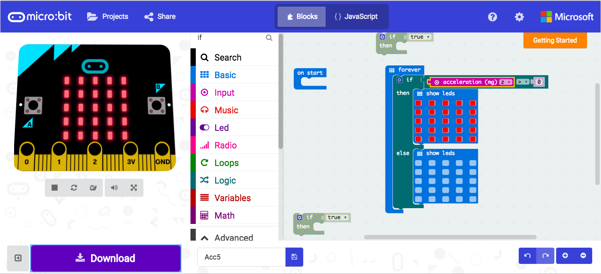

# Accelerometer
these work in g's, the force of gravity down upon an object. Our microbit seems to not respond to human force, since it will not regester when we poke or tap on the micro bit. When we flip it over, gravity pulls down on it, then it seems to respond.

